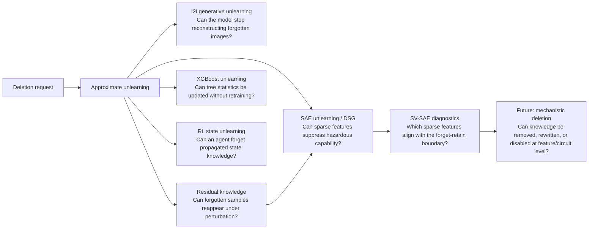

# Knowledge Removal: Machine Unlearning and Residual Knowledge

> **Removing unwanted knowledge from models — and auditing whether deletion is robust under generation, perturbation, model structure, sequential behavior, sparse internal features, and boundary-aligned feature geometry.**

Deleting a file is easy. Deleting its influence from a trained model is not.

A trained model does not store data as rows in a database. It distributes information across weights, representations, decision boundaries, generated outputs, tree statistics, value functions, and sparse internal features. This makes **machine unlearning** broader than lowering accuracy on a forget set. When a user, regulator, or system owner asks that some data, behavior, or capability be forgotten, we need to ask:

> **What would convince us that the model no longer uses the unwanted knowledge?**

This repository is a research-story README for a line of work on **Knowledge Removal**. It connects papers and demo artifacts around one thesis:

> **Unlearning is incomplete if the model merely fails on the original forget samples. A trustworthy deletion mechanism must also remove residual knowledge that can reappear through generation, perturbation, model structure, sequential behavior, sparse internal features, or boundary-aligned internal representations.**

The repo is not a monolithic codebase. It is a readable portfolio artifact that connects six related projects:

- **Image-to-image generative unlearning** — can a generative model stop reconstructing forgotten images?
- **Robust unlearning / residual knowledge** — can deleted samples reappear under perturbation?
- **XGBoost unlearning** — can tabular tree ensembles remove forget-sample statistics without retraining?
- **RL state unlearning** — can an agent forget state-level knowledge that has propagated through value learning?
- **SAE unlearning / Dynamic SAE Guardrails** — can sparse internal features suppress hazardous capability at inference time?
- **SV-SAE diagnostics** — can boundary-aligned sparse features reveal which internal features are more causally useful for dynamic unlearning?

The SAE artifacts are included with an important caveat: they are currently best understood as **inference-time hazardous-capability suppression and diagnostics**, not full weight-level machine unlearning. That distinction is part of the point. It shows where mechanistic interventions are promising, where they still fall short of retrained-model deletion guarantees, and how we might move from feature-level guardrails toward true mechanistic deletion.

---

## The core question

The usual gold standard for unlearning is retraining from scratch without the forget set. Approximate unlearning tries to imitate that retrained reference without paying the full cost of retraining.

That comparison is necessary, but not sufficient. It hides harder questions:

- What if an image generator stops reproducing the exact forget image, but can still reconstruct it from partial information?
- What if a classifier appears to forget the original sample, but still recognizes small perturbations of it better than a retrained model?
- What if the model is an XGBoost ensemble whose training influence is stored in gradient and Hessian statistics?
- What if the target is not a data point, but an RL state whose influence has propagated backward through credit assignment?
- What if the unwanted knowledge is a hazardous capability represented by sparse features that can be gated or clamped during inference?
- What if the feature selector itself is wrong: it detects the forget domain, but does not identify features that causally control the forget-retain boundary?

These cases point to a broader lesson:

> **Forgetting is not a pointwise property. It is a neighborhood, generative, structural, behavioral, mechanistic, and geometric property.**



---

## 1. From classification unlearning to generative unlearning

Early unlearning work mostly focused on classifiers. The forget target is a data point, a class, or a subset of samples, and the goal is for the unlearned classifier to behave like a retrained classifier.

Generative models create a more direct privacy risk. A model may not merely classify a forgotten image; it may **reconstruct, complete, or regenerate** it from partial information. If a model can reconstruct a training image from a cropped or masked input, then the forgotten information remains operationally present.

**Machine Unlearning for Image-to-Image Generative Models** studies this setting. It asks:

> When an image-to-image generative model receives partial information about a forgotten image, can it still faithfully reconstruct the original?

The work formulates unlearning for image-to-image generation across diffusion models, VQ-GAN, and masked autoencoders. The method preserves retain-set generation quality while pushing forget-set generations toward uninformative outputs. The key idea is representation-space editing: retain samples stay aligned with their original representations, while forget samples are pushed toward representations induced by Gaussian noise.

This project broadens unlearning from prediction to **reconstruction and generation**.

**Paper:** [Machine Unlearning for Image-to-Image Generative Models](https://arxiv.org/pdf/2402.00351)  
**Code:** [jpmorganchase/i2i-generator-unlearning](https://github.com/jpmorganchase/i2i-generator-unlearning)

---

## 2. From apparent forgetting to residual knowledge

A model can pass standard unlearning checks and still retain traces of the forget set.

**The Unseen Threat: Residual Knowledge in Machine Unlearning under Perturbed Samples** studies this failure mode. Standard approximate unlearning often compares the unlearned model and the retrained reference on original forget samples, retain samples, and test samples. But these checks do not necessarily cover the local neighborhood around a forgotten point.

The sharper question is:

> If a forget sample is slightly perturbed, does the unlearned model still recognize it more often than a retrained model?

Often, the answer is yes. This gap is **residual knowledge**: latent information about the forget sample that remains in the unlearned model and can be exposed by perturbations.

For a forget sample $(x,y)$ and perturbed inputs $x' \sim B_p(x,\tau)$, residual knowledge compares how often the unlearned model $m$ and retrained reference $a$ predict the original label:

$$
r_\tau((x,y)) = \frac{\Pr[m(x') = y]}{\Pr[a(x') = y]}.
$$

When $r_\tau > 1$, the unlearned model recognizes perturbed variants of the forget sample more often than retraining. That is concrete evidence that deletion is incomplete.

The mitigation, **RURK** — Robust Unlearning that suppresses Residual Knowledge — fine-tunes the unlearned model to penalize re-recognition of vulnerable perturbations while preserving retain-set utility.

This project turns unlearning evaluation from a static forget-set check into a robustness audit.

**Paper:** [The Unseen Threat: Residual Knowledge in Machine Unlearning under Perturbed Samples](https://proceedings.neurips.cc/paper_files/paper/2025/file/2656bba937d78593fbd99ace9f14e311-Paper-Conference.pdf)  
**Code:** [HsiangHsu/Robust-Unlearning](https://github.com/HsiangHsu/Robust-Unlearning)

---

## 3. From neural models to XGBoost unlearning

Many deployed high-stakes systems are not deep neural networks. They are tabular models, especially gradient-boosted trees such as XGBoost, used in finance, risk modeling, fraud detection, insurance, healthcare, and ranking.

This raises a practical question:

> Can we remove data from an XGBoost model without retraining the full boosted ensemble?

The **XGBoost-Unlearning** artifact treats unlearning as a model-family-specific editing problem. Instead of treating the booster as a black box, it reads the trained tree structure, routes forget samples through the ensemble, subtracts their first- and second-order loss contributions from affected nodes, and recomputes Newton-step weights.

For a node $n$, if forget samples contribute

$$
\Delta G_n = \sum_{i \in D_f \cap S_n} g_i, \qquad
\Delta H_n = \sum_{i \in D_f \cap S_n} h_i,
$$

the update subtracts these contributions from the stored statistics and recomputes the node or leaf weight.

This artifact matters because it shows that knowledge removal must respect how each model family stores influence. Unlearning a diffusion model, a classifier, a tree ensemble, an RL agent, and a sparse-feature-intervened language model cannot rely on the same mechanical update.

**Code:** [HsiangHsu/XGBoost-Unlearning](https://github.com/HsiangHsu/XGBoost-Unlearning)

---

## 4. From static examples to RL state unlearning

Supervised unlearning starts with a dataset and a forget subset. Reinforcement learning is different. An agent learns through interaction, rewards, transitions, bootstrapping, and credit assignment.

This creates a different deletion target:

> What does it mean for an agent to forget a state?

The **RL-Unlearning** demo studies state-level unlearning in a minimal GridWorld. Deleting transitions from a replay buffer is not enough: a state can influence predecessor states through temporal-difference targets, learned values, and policy preferences. Even if the forget state is no longer directly updated, its influence may remain distributed throughout the value function.

The demo contrasts three objects:

1. **Original training:** the agent learns from the original environment.
2. **Exact retraining:** learning signals associated with the forget state are invalidated, then the agent is retrained as the gold-standard reference.
3. **Value Obfuscation:** an approximate method that starts from the original Q-function and obfuscates value targets associated with the forget state so behavior moves closer to retraining.

This artifact shifts unlearning from data removal to **behavior removal**. In sequential decision-making, knowledge is not localized to one example; it is propagated through time.

**Code:** [HsiangHsu/RL-Unlearning](https://github.com/HsiangHsu/RL-Unlearning)

---

## 5. From behavioral deletion to SAE-based capability suppression

The previous projects treat unlearning as behavioral or structural deletion: imitate retraining, stop reconstruction, subtract tree statistics, or remove the effect of a state from a value function. Language models raise a more mechanistic question:

> Can unwanted capability be suppressed by intervening on sparse internal features that appear to represent it?

The **SAE-Unlearning** repo studies this question through **Dynamic SAE Guardrails (DSG)** on **WMDP-Cyber**, using `google/gemma-2-2b-it` and Gemma Scope sparse autoencoders. It should be read as **inference-time hazardous-capability suppression**, not weight-level deletion: model weights are not retrained, but selected SAE features are used to suppress cyber-relevant behavior while preserving general utility.

The value of the repo is not just the final accuracy number. It decomposes why the intervention works:

1. **SAE hook faithfulness:** SAE passthrough is faithful only when the reconstruction residual is preserved.
2. **Feature relevance:** naive forget-feature clamping reduces WMDP-Cyber, showing the selected features matter.
3. **Residual leakage diagnostic:** residual cleansing tests whether the remaining capability bypasses the clamp through the SAE reconstruction residual.
4. **DSG mechanism ablation:** sequence-level gating and dense hot-token clamping are separated.
5. **Dynamic Circuit Guardrails:** the single-layer intervention is extended to small multi-layer SAE circuits.

The central result is:

> **DSG = sequence-level domain gate + dense hot-token feature-subspace suppression.**

In the reproduced configuration, naive feature clamping reduces WMDP-Cyber accuracy from 100.0% to 61.1%, while tuned DSG reduces it to 33.8% with MMLU-All utility at 99.1%. Mechanism ablation shows the division of labor: dense hot-token clamping drives WMDP-Cyber suppression, while sequence-level gating preserves MMLU utility.

The multi-layer extension, **Dynamic Circuit Guardrails (DCG)**, is promising but not automatically better. Adding one additional layer produces a small run-level improvement in the reported setup, but adding more layers quickly trades away utility.

This artifact adds a mechanistic layer to Knowledge Removal. It asks not only whether unwanted knowledge appears in outputs, but whether it can be localized, suppressed, or eventually removed through sparse feature geometry.

It also keeps the key distinction explicit:

> **SAE guardrails suppress access to a capability at inference time. They do not yet prove that the capability has been deleted from the model.**

That distinction makes the artifact more useful, not less: it clarifies the path from behavioral unlearning toward true mechanistic deletion.

**Code:** [HsiangHsu/SAE-Unlearning](https://github.com/HsiangHsu/SAE-Unlearning)

---

## 6. From SAE guardrails to boundary-aligned SAE diagnostics

Dynamic SAE Guardrails show that sparse features can suppress hazardous capability at inference time. But they raise a sharper mechanistic question:

> Which SAE features should be suppressed?

A feature selector can be a strong **detector** and still be a weak **intervention target selector**. DSG-style methods select features by marginal forget/retain activation statistics, often through a Fisher-ratio-like score. This is computationally efficient, but it treats each feature independently. It can identify features that are common in the forget domain without identifying the features that actually form the forget-retain decision boundary.

The **SV-SAE** artifact studies this gap. It asks:

> Are SAE features selected by a discriminative forget-retain margin more useful for dynamic unlearning than Fisher-ratio selected features?

SV-SAE trains a linear SVM on mean-pooled SAE activations from forget and retain examples. The same SVM normal vector is then used for two purposes:

1. **Runtime triggering:** detect whether an input lies on the forget side of the learned margin.
2. **Feature selection:** rank features by their support-vector-weighted contribution to the margin.

Formally, SV-SAE trains an elastic-net SVM:

$$
\min_{w,b} \sum_i \max(0, 1 - y_i(w^\top z_i + b)) + \lambda_1 \|w\|_1 + \lambda_2 \|w\|_2^2,
$$

then ranks SAE features by:

$$
K_{\text{SV-SAE}} =\text{TopK}_j \left(|w_j| \cdot \mathbb{E}_{i \in \mathrm{SV}} |z_{ij}|\right).
$$

The intervention uses residual-preserving SAE clamping:

$$
h' = h + \mathrm{SAE.decode}(z') - \mathrm{SAE.decode}(z),
$$

where selected features in $z'$ are scaled by $(1-\lambda)$. This keeps the SAE reconstruction residual intact while modifying the targeted sparse-feature subspace.

The key conceptual move is:

> **DSG asks which features are forget-heavy. SV-SAE asks which features define the forget-retain boundary.**

### Main SV-SAE findings

On WMDP-Cyber vs MMLU with `google/gemma-2-2b` and Gemma Scope layer 3:

- DSG is a strong domain detector but a weak intervention feature selector.
  - DSG detector: AUC-ROC = 0.936, AUC-PR = 0.951.
  - DSG intervention features produce at most about 3% forget drop across tested $K$ and $\lambda$.
- SV-SAE learns a stronger forget-retain margin.
  - SV-SAE detector: test AUC-ROC = 0.994, test AUC-PR = 0.994.
  - DSG/SV-SAE top-128 feature overlap: 0 / 128.
- SV-SAE features are more boundary-aligned.
  - Median support-vector enrichment: DSG = 0.050, SV-SAE = 1.252.
  - Median margin-proximity correlation: DSG = -0.218, SV-SAE = +0.222.
- Triggered SV-SAE intervention works in the small diagnostic setting.
  - Best small-scale result on 100/100 examples:
    - SV-SAE trigger, $K=16$, $\lambda=0.75$
    - Forget drop = 0.16, 95% CI [0.08, 0.26]
    - Retain drop = 0.01, 95% CI [0.00, 0.03]
- Scale-up exposes the real bottleneck: feature-selection instability.
  - Per-seed top-16 SV-SAE selection has low transfer stability across 100/100 and 300/300 scales.
  - Fixed SV-SAE feature sets transfer better than reselecting per split.
  - Feature stability, not merely trigger calibration, becomes the main obstacle for scale.

This result is important for the broader story because it prevents a simplistic conclusion that “SAE features solve unlearning.” Instead, it shows that mechanistic unlearning needs at least three separable ingredients:

1. **Detection:** can we identify when the unwanted capability is being invoked?
2. **Feature geometry:** can we identify sparse features aligned with the forget-retain boundary?
3. **Causal intervention:** can we suppress those features without collateral utility damage?

SV-SAE is therefore best read as a **diagnostic bridge** between SAE guardrails and future mechanistic deletion. It does not claim full removal of cyber knowledge. It shows that boundary-aware sparse-feature selection is more informative than marginal feature scoring, while also revealing that scalable feature stability remains unsolved.

**Code:** [HsiangHsu/SV-SAE](https://github.com/HsiangHsu/SV-SAE)

---

## The research arc

The six artifacts form a progression:

1. **Generative unlearning:** can a model stop reconstructing forgotten visual information?
2. **Robust unlearning:** can forgotten samples reappear under perturbation?
3. **Tree-model unlearning:** can forget-sample influence be removed from structured booster statistics?
4. **RL state unlearning:** can an agent forget state-level knowledge propagated through value learning?
5. **SAE capability suppression:** can sparse internal features suppress unwanted capability at inference time?
6. **Boundary-aligned SAE diagnostics:** can we identify which sparse features are actually aligned with the forget-retain boundary?

Together, they support a broader view:

> **Machine unlearning is not one algorithm. It is a family of deletion problems whose correct form depends on how a model stores, transforms, exposes, and reuses knowledge.**

The line of work moves from **behavioral deletion** to **robust deletion**, then to **model-family-specific deletion**, and finally toward **mechanistic deletion**. The current SAE and SV-SAE artifacts do not finish that last step; they make the gap explicit and measurable.

---

## Artifact map

| Artifact | Main question | Key contribution | Link |
|---|---|---|---|
| **Image-to-Image Generative Unlearning** | Can a generative model stop reconstructing forgotten images from partial inputs? | General unlearning framework for I2I generative models including diffusion models, VQ-GAN, and MAE. | [Paper](https://arxiv.org/pdf/2402.00351) · [Code](https://github.com/jpmorganchase/i2i-generator-unlearning) |
| **Robust Unlearning / Residual Knowledge** | Can deleted knowledge reappear under perturbation? | Defines residual knowledge and proposes RURK to suppress recognition of perturbed forget samples. | [Paper](https://proceedings.neurips.cc/paper_files/paper/2025/file/2656bba937d78593fbd99ace9f14e311-Paper-Conference.pdf) · [Code](https://github.com/HsiangHsu/Robust-Unlearning) |
| **XGBoost Unlearning** | Can tabular tree ensembles be approximately unlearned without full retraining? | Updates XGBoost booster statistics by subtracting forget-sample gradient and Hessian contributions. | [Code](https://github.com/HsiangHsu/XGBoost-Unlearning) |
| **RL State Unlearning** | Can an RL agent forget state-level knowledge and propagated credit assignment? | Minimal GridWorld demo of exact retraining semantics and Value Obfuscation for state unlearning. | [Code](https://github.com/HsiangHsu/RL-Unlearning) |
| **SAE Unlearning / DSG** | Can sparse internal features suppress hazardous capability at inference time? | Reproduces and ablates Dynamic SAE Guardrails on WMDP-Cyber; dense hot-token clamping drives suppression while sequence gating preserves utility. | [Code](https://github.com/HsiangHsu/SAE-Unlearning) |
| **SV-SAE Diagnostics** | Which SAE features are useful intervention targets rather than only forget-domain indicators? | Uses support-vector-guided feature ranking to select boundary-aligned SAE features; shows stronger diagnostic intervention but exposes feature-selection instability at scale. | [Code](https://github.com/HsiangHsu/SAE-SVM-Unlearning) |

---

## What this line of work argues

A useful unlearning audit should ask more than whether original forget samples are misclassified or no longer reconstructed. It should ask:

- **Pointwise deletion:** Does the model behave like retraining on the original forget samples?
- **Neighborhood deletion:** Does the model behave like retraining under small perturbations of those samples?
- **Generative deletion:** Can the model still reconstruct, complete, or regenerate forgotten content?
- **Structural deletion:** Has the forget data been removed from model-specific sufficient statistics, such as tree gradients and Hessians?
- **Behavioral deletion:** Has the target knowledge stopped influencing downstream actions, values, and policies?
- **Mechanistic suppression:** Can feature- or circuit-level probes still recover the supposedly removed concept, and can sparse feature interventions suppress access to it?
- **Boundary alignment:** Are selected internal features merely correlated with the forget domain, or are they aligned with the forget-retain decision boundary?
- **Feature stability:** Do selected sparse features transfer across seeds, sample sizes, and evaluation splits?
- **Guardrail-vs-unlearning distinction:** Is the method deleting knowledge from weights, or only suppressing access to it at inference time?

The last three questions are especially important for foundation models. They prevent overclaiming while still making sparse feature interventions part of the unlearning research agenda.

---

## What this repository does not claim

This repository intentionally avoids overstating the current state of mechanistic unlearning.

- It does **not** claim that SAE guardrails delete knowledge from model weights.
- It does **not** claim that SV-SAE fully removes cyber knowledge.
- It does **not** claim production-ready unlearning for foundation models.
- It does **not** claim that a single-layer SAE intervention is sufficient for robust unlearning.
- It does **not** claim that boundary-aligned features are stable enough for deployment.

Instead, the claim is narrower and more useful:

> **These artifacts provide a research path for auditing and improving knowledge removal: from apparent forgetting, to residual-knowledge robustness, to model-specific deletion, to sparse-feature suppression, to boundary-aware mechanistic diagnostics.**

---

## Future directions

### From SAE guardrails to true mechanistic unlearning

The current SAE artifacts show that sparse feature interventions can suppress hazardous capability at inference time, and that boundary-aware feature selection can identify more useful intervention targets than marginal Fisher-ratio scoring. But they do not yet provide weight-level deletion or retrained-model equivalence.

The next question is:

> Can we identify, suppress, rewrite, or remove sparse features and circuits corresponding to unwanted knowledge while preserving unrelated capabilities?

This would extend the current line from **behavioral imitation of retraining** to **mechanistic removal or controlled inactivation of identifiable knowledge units**.

### Stable feature selection for mechanistic deletion

SV-SAE suggests that boundary-aligned features can be more useful than forget-heavy features, but scale-up exposes feature instability. Future work should study stability-aggregated feature selection, cross-seed feature consensus, multi-layer circuit selection, and support-vector neighborhoods that transfer across sample sizes.

### Robust certification beyond original samples

Residual-knowledge results suggest that certified unlearning should cover local neighborhoods around forget samples, not only the exact samples. Future certification could combine indistinguishability with adversarial robustness, distributional robustness, or certified perturbation bounds.

### Unlearning for foundation models

The same principles should extend to language models and multimodal systems. The hard part is defining the forget unit: a document, fact, style, behavior, concept, private entity, or unsafe skill. Evaluation must then check direct recall, paraphrases, perturbations, latent representations, and multi-hop elicitation.

### Residual knowledge as a general audit metric

Residual knowledge can become a general-purpose audit for deletion quality: instead of asking only whether an unlearned model passes forget-set metrics, ask whether it retains a statistically detectable advantage over retraining around the forget data.

### Model-family-specific unlearning

XGBoost unlearning, RL unlearning, SAE guardrails, and SV-SAE diagnostics all show that unlearning must respect how knowledge is stored. Future work should develop specialized deletion operators for tree ensembles, retrieval systems, reward models, agents, sparse feature representations, and modular neural architectures.

---

## Suggested citation cluster

```bibtex
@inproceedings{li2024machine,
  title={Machine Unlearning for Image-to-Image Generative Models},
  author={Li, Guihong and Hsu, Hsiang and Chen, Chun-Fu Richard and Marculescu, Radu},
  booktitle={International Conference on Learning Representations},
  year={2024}
}

@inproceedings{hsu2025unseen,
  title={The Unseen Threat: Residual Knowledge in Machine Unlearning under Perturbed Samples},
  author={Hsu, Hsiang and Niroula, Pradeep and He, Zichang and Brugere, Ivan and Lecue, Freddy and Chen, Chun-Fu},
  booktitle={Advances in Neural Information Processing Systems},
  year={2025}
}
```

---

## One-line summary

**This research line studies machine unlearning as robust knowledge removal: not only making a model appear to forget, but auditing whether forgotten information survives through generation, perturbation, model structure, sequential behavior, sparse internal features, or boundary-aligned feature geometry.**
