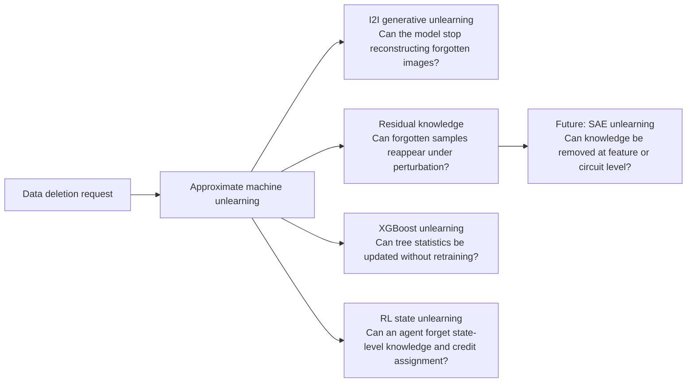

# Knowledge Removal: Machine Unlearning and Residual Knowledge

> **Removing unwanted knowledge from models — and auditing whether deletion is robust under attacks, perturbations, and behavioral probes.**

Deleting a file is easy. Deleting its influence from a trained model is not.

A model does not store training data as rows in a database. It folds data into weights, representations, decision boundaries, generated outputs, value functions, and sometimes even implicit behaviors that only appear under perturbation. This is the central challenge of **machine unlearning**: when a user, regulator, or system owner asks that some data or behavior be forgotten, what does it mean for the model to truly forget?

This repository is a **research-story README** for a line of work on **Knowledge Removal**. It connects several papers and demo artifacts around a single thesis:

> **Unlearning is not complete when a model merely fails on the original forget samples. A trustworthy deletion mechanism must also remove residual knowledge that can reappear through generation, perturbation, model structure, or sequential decision making.**

The goal of this repo is not to provide a new monolithic codebase. Instead, it serves as a readable portfolio artifact that connects four related projects:

- **Machine unlearning for image-to-image generative models**
- **Residual knowledge and robust unlearning under perturbed samples**
- **XGBoost unlearning for tabular models**
- **RL state unlearning for sequential decision-making**

SAE-based unlearning is intentionally left as a future direction because that artifact is still under development.

---

## The core question

Most definitions of machine unlearning compare an unlearned model with a model retrained from scratch without the forget set. This is the right gold standard: if retraining without the data is the clean reference, then approximate unlearning should imitate that reference while avoiding the cost of full retraining.

But this comparison hides several difficult questions.

What if the model no longer recognizes the exact forget image, but still reconstructs it from partial information? What if it appears to forget an image, but recognizes small adversarial perturbations of it better than a retrained model? What if the model is not a neural classifier at all, but an XGBoost model whose knowledge is stored in tree statistics? What if the target to forget is not a static example, but a state in a reinforcement-learning environment whose influence has already propagated through value estimates and credit assignment?

These cases point to the same lesson:

> **Forgetting is not a pointwise property. It is a neighborhood, structural, and behavioral property.**

The projects below explore that idea from different angles.



---

## 1. From classification unlearning to generative unlearning

Early machine unlearning work mostly focused on classifiers. The forget target is often a training example, a class, or a subset of data, and the goal is to make the unlearned classifier behave like a retrained classifier.

But generative models introduce a different failure mode. A generative model may not merely classify a forgotten image. It may **reconstruct** it, complete it, or regenerate visual details from partial information. This makes unlearning more difficult and more urgent: if a model can reconstruct a training image from a masked or cropped input, then the information is still operationally present.

The paper **Machine Unlearning for Image-to-Image Generative Models** studies this setting directly. It asks:

> When an image-to-image generative model receives partial information about a forgotten image, can it still faithfully reconstruct the original?

The work formulates unlearning for image-to-image generation across multiple architectures, including diffusion models, VQ-GAN, and masked autoencoders. The method preserves generation quality on the retain set while driving forget-set generations toward uninformative outputs. The key idea is to operate in representation space: retain samples are aligned with their original representations, while forget samples are pushed toward representations induced by Gaussian noise.

This project matters because it broadens the scope of unlearning beyond classification. It treats forgetting as a property of **reconstruction and generation**, not only prediction.

**Paper:** [Machine Unlearning for Image-to-Image Generative Models](https://arxiv.org/pdf/2402.00351)  
**Code:** [jpmorganchase/i2i-generator-unlearning](https://github.com/jpmorganchase/i2i-generator-unlearning)

---

## 2. From apparent forgetting to residual knowledge

A model can pass standard unlearning checks and still retain traces of the forget set.

This is the motivation behind **The Unseen Threat: Residual Knowledge in Machine Unlearning under Perturbed Samples**. Standard approximate unlearning usually evaluates whether the unlearned model resembles a retrained model on original forget samples, retain samples, or test samples. But these checks do not necessarily cover the local neighborhood around a forgotten point.

The paper asks a sharper question:

> If a forget sample is slightly perturbed, does the unlearned model still recognize it more often than a retrained model?

The answer is often yes. This gap is called **residual knowledge**: latent information about the forget sample that remains in the unlearned model and can be exposed through perturbations.

Formally, for a forget sample $(x,y)$ and perturbed inputs $x' \sim B_p(x,\tau)$, residual knowledge compares how often the unlearned model $m$ and the retrained reference model $a$ predict the original label:

$$
r_\tau((x,y)) = \frac{\Pr[m(x') = y]}{\Pr[a(x') = y]}.
$$

When $r_\tau > 1$, the unlearned model is more likely than the retrained reference to recognize perturbed versions of the forget sample. That is a concrete sign that deletion is incomplete.

The proposed mitigation, **RURK** — Robust Unlearning that suppresses Residual Knowledge — fine-tunes the unlearned model to penalize its ability to re-recognize vulnerable perturbations of forget samples while preserving utility on retain data.

This project turns unlearning evaluation from a static test into a robustness audit. It says that deletion should not only hold at the original point; it should hold in the local region where adversaries, perturbations, and distribution shifts may reveal what remains.

**Paper:** [The Unseen Threat: Residual Knowledge in Machine Unlearning under Perturbed Samples](https://proceedings.neurips.cc/paper_files/paper/2025/file/2656bba937d78593fbd99ace9f14e311-Paper-Conference.pdf)  
**Code:** [HsiangHsu/Robust-Unlearning](https://github.com/HsiangHsu/Robust-Unlearning)

---

## 3. From neural models to XGBoost unlearning

Many high-stakes machine-learning systems do not use deep neural networks. They use tree ensembles, especially gradient-boosted models such as XGBoost, because these models are strong on tabular data and widely used in finance, risk modeling, fraud detection, and healthcare analytics.

This raises a practical question:

> Can we unlearn data from an XGBoost model without retraining the entire boosted ensemble?

The **XGBoost-Unlearning** artifact explores this question as an engineering and research prototype. Instead of treating the model as a black box, it reads the trained booster structure, routes forget samples through the trees, subtracts their first- and second-order loss contributions from affected nodes, and recomputes Newton-step weights.

At a high level, the model stores knowledge in aggregated gradient and Hessian statistics. For a node $n$, if forget samples contribute

$$
\Delta G_n = \sum_{i \in D_f \cap S_n} g_i, \qquad
\Delta H_n = \sum_{i \in D_f \cap S_n} h_i,
$$

the unlearning update subtracts those contributions and updates the corresponding node or leaf weight.

This artifact matters because it moves unlearning toward the kinds of models that are actually deployed in many structured-data pipelines. It also shows that “knowledge removal” has to be model-family aware: unlearning a diffusion model, a classifier, and a boosted tree cannot rely on the same mechanical update.

**Code:** [HsiangHsu/XGBoost-Unlearning](https://github.com/HsiangHsu/XGBoost-Unlearning)

---

## 4. From static examples to RL state unlearning

Supervised unlearning usually starts with a dataset and a forget subset. Reinforcement learning is different. An RL agent does not simply memorize independent examples; it learns through interaction, rewards, transitions, bootstrapping, and credit assignment.

This creates a new question:

> What does it mean for an agent to forget a state?

The **RL-Unlearning** demo studies state-level unlearning in a minimal GridWorld setting. The key point is that deleting transitions from a replay buffer is not enough. A state can influence predecessor states through temporal-difference targets, learned values, and policy preferences. Even if the state itself is no longer directly used, its influence may remain distributed throughout the value function.

The demo contrasts three ideas:

1. **Original training**, where the agent learns from the original environment.
2. **Exact retraining**, where learning signals associated with the forget state are invalidated and the agent is retrained as a gold-standard reference.
3. **Value Obfuscation**, an approximate method that starts from the original Q-function and modifies value targets associated with the forget state so that the resulting behavior moves closer to the retrained policy.

This artifact matters because it shifts unlearning from data removal to **behavior removal**. In sequential decision-making, knowledge is not localized to one example. It is propagated through time.

**Code:** [HsiangHsu/RL-Unlearning](https://github.com/HsiangHsu/RL-Unlearning)

---

## The research arc

The four artifacts form a progression.

First, image-to-image generative unlearning asks whether a model can stop reconstructing forgotten visual information. This expands unlearning from classifiers to generative models.

Second, residual knowledge asks whether a model that appears to forget can still reveal local traces of the forget set under perturbation. This makes unlearning evaluation adversarial and robustness-aware.

Third, XGBoost unlearning asks how knowledge can be removed from a model family that stores information in tree structures and gradient statistics. This brings unlearning closer to practical tabular systems.

Fourth, RL state unlearning asks how deletion works when information is distributed through trajectories and value propagation. This moves unlearning from static data to sequential behavior.

Together, they suggest a broader view:

> **Machine unlearning is not one algorithm. It is a family of deletion problems whose correct form depends on how a model stores, transforms, and uses knowledge.**

---

## Artifact map

| Artifact | Main question | Key contribution | Link |
|---|---|---|---|
| **Image-to-Image Generative Unlearning** | Can a generative model stop reconstructing forgotten images from partial inputs? | General unlearning framework for I2I generative models including diffusion models, VQ-GAN, and MAE. | [Paper](https://arxiv.org/pdf/2402.00351) · [Code](https://github.com/jpmorganchase/i2i-generator-unlearning) |
| **Robust Unlearning / Residual Knowledge** | Can deleted knowledge reappear under perturbation? | Defines residual knowledge and proposes RURK to suppress recognition of perturbed forget samples. | [Paper](https://proceedings.neurips.cc/paper_files/paper/2025/file/2656bba937d78593fbd99ace9f14e311-Paper-Conference.pdf) · [Code](https://github.com/HsiangHsu/Robust-Unlearning) |
| **XGBoost Unlearning** | Can tabular tree ensembles be approximately unlearned without full retraining? | Updates XGBoost booster statistics by subtracting forget-sample gradient and Hessian contributions. | [Code](https://github.com/HsiangHsu/XGBoost-Unlearning) |
| **RL State Unlearning** | Can an RL agent forget state-level knowledge and propagated credit assignment? | Minimal GridWorld demo of exact retraining semantics and Value Obfuscation for state unlearning. | [Code](https://github.com/HsiangHsu/RL-Unlearning) |

---

## What this line of work argues

A useful unlearning audit should ask more than whether the original forget samples are misclassified or no longer reconstructed. It should ask:

- **Pointwise deletion:** Does the model behave like retraining on the exact forget samples?
- **Neighborhood deletion:** Does the model behave like retraining under small perturbations of those samples?
- **Generative deletion:** Can the model still reconstruct, complete, or regenerate forgotten content?
- **Structural deletion:** Has the forget data been removed from model-specific sufficient statistics, such as tree gradients and Hessians?
- **Behavioral deletion:** Has the target knowledge stopped influencing downstream actions, values, and policies?
- **Mechanistic deletion:** Can future feature- or circuit-level probes still recover the supposedly removed concept?

The last point is the bridge to future work.

---

## Future directions

### SAE unlearning: from behavioral deletion to mechanistic deletion

A natural next step is to connect machine unlearning with sparse autoencoders and mechanistic interpretability. Instead of only fine-tuning model outputs, can we identify SAE features or circuits corresponding to unwanted knowledge and remove, suppress, or rewrite them directly?

This would extend the current line from:

> unlearning as behavioral imitation of retraining

into:

> unlearning as mechanistic removal of identifiable knowledge units.

This artifact is not included yet, but it is the most direct future extension of the Knowledge Removal agenda.

### Robust certification beyond original samples

The residual-knowledge results suggest that certified unlearning should account for local neighborhoods around forget samples, not only the samples themselves. Future certification could combine indistinguishability with adversarial robustness, distributional robustness, or certified perturbation bounds.

### Unlearning for foundation models

The same principles should extend to language models and multimodal systems. The hard part is defining what counts as the forget unit: a document, fact, style, behavior, concept, private entity, or unsafe skill. The evaluation must then check not only direct recall but also paraphrases, perturbations, latent representations, and multi-hop elicitation.

### Residual knowledge as a general audit metric

Residual knowledge can become a general-purpose audit for deletion quality. Instead of asking only whether an unlearned model passes standard forget-set metrics, we can ask whether it retains a statistically detectable advantage over retraining around the forget data.

### Model-family-specific unlearning

XGBoost unlearning and RL unlearning show that unlearning must respect how knowledge is stored. Future work should develop specialized deletion operators for tree ensembles, retrieval systems, reward models, agents, and modular neural architectures.

---

## Suggested citation cluster

```bibtex
@inproceedings{li2024machine,
  title={Machine Unlearning for Image-to-Image Generative Models},
  author={Li, Guihong and Hsu, Hsiang and Chen, Chun-Fu Richard and Marculescu, Radu},
  booktitle={International Conference on Learning Representations},
  year={2024}
}

@inproceedings{hsu2025unseen,
  title={The Unseen Threat: Residual Knowledge in Machine Unlearning under Perturbed Samples},
  author={Hsu, Hsiang and Niroula, Pradeep and He, Zichang and Brugere, Ivan and Lecue, Freddy and Chen, Chun-Fu},
  booktitle={Advances in Neural Information Processing Systems},
  year={2025}
}
```

---

## One-line summary

**This research line studies machine unlearning as robust knowledge removal: not only making a model appear to forget, but auditing whether forgotten information survives through generation, perturbation, model structure, or sequential behavior.**
